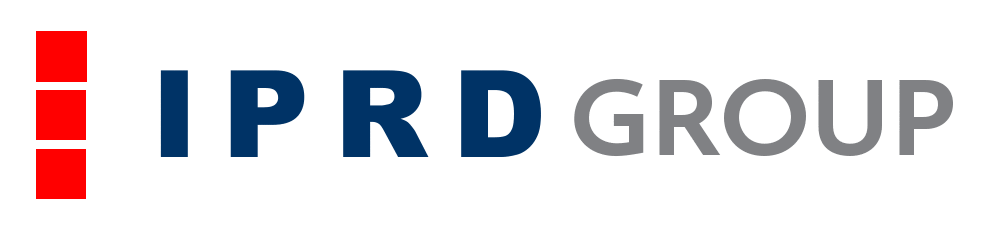

.. rst-class:: hide-header

.. rst-class:: hide-header

Welcome to RDT-Reader
======================

.. toctree::
   :maxdepth: 2

Quickstart
==========

1. Enable git LFS so that the models can be downloaded. Refer https://help.github.com/en/articles/installing-git-large-file-storage

2. Clone this repo into <rdt-reader>

3. Now Clone the following repo into <rdt-reader>/tensorflow-yolov3
        
        git clone https://github.com/kashyapj2793/tensorflow-yolov3.git

4. Check there should be a models sub folder in tensorflow-yolov3

5. For data annotation you can use any tool that you like. We used VOTT https://github.com/Microsoft/VoTT/releases version 1.7.2

Data Format
------------

Two data formats are used, the first one listed below is to train the object detection model and the second for the red and blue line detection.

1. You can find an example of it here https://raw.githubusercontent.com/YunYang1994/tensorflow-yolov3/master/data/dataset/voc_train.txt and in the **tensorflow-yolov3/data/dataset/rdt_train.txt**

2. You can find an example of it in **dataset/labels/** folder . Each file consists of annotations for an image with the same base file name.

Set-up enviroment
-----------------
.. code-block:: unix

    pip install -r requirements.txt

Using service with pretrained models
------------------------------------

.. code-block:: unix

    python flasker.py

A local flask server will be setup running on localhost:9000.

You can hit this server as described in the documentation here_.

.. _here: https://drive.google.com/open?id=1Tbz2k5p9v9xEIhrNy9WP4w5mPTyPjVOPRIxeHn87r74

There is a saved postman collection (audere_local.postman_collection) in the root directory which can be used to test the API with Postman. Please change the image file to a file that resides on your system.

Train Object recognition model
------------------------------

For detailed instructions please follow the README https://github.com/kashyapj2793/tensorflow-yolov3 . Edit the **tensorflow-yolov3/core/config.py** file first and set the absolute paths correctly.

.. code-block:: unix

    cd tensorflow
    python train.py

You will find models being saved in the **tensorflow-yolov3/checkpoint** directory. 

Freeze Object recognition model for inference
---------------------------------------------

Use the script **tensorflow-yolov3/freeze_yolo_tf.py** . Please change the paths to select the newly trained model and new export directory.

Train red-line detection model
------------------------------

.. code-block:: unix

    cd ..
    python train_blue_red.py

You can change the name and location of the saved model from within the script. 

Freeze red-line detection model for inference
---------------------------------------------

Use the script :ref:`freezeline` . Please change the paths to select the newly trained model and new export directory.

Indices and tables
==================
 
* :ref:`genindex`
* :ref:`modindex`
* :ref:`search`
